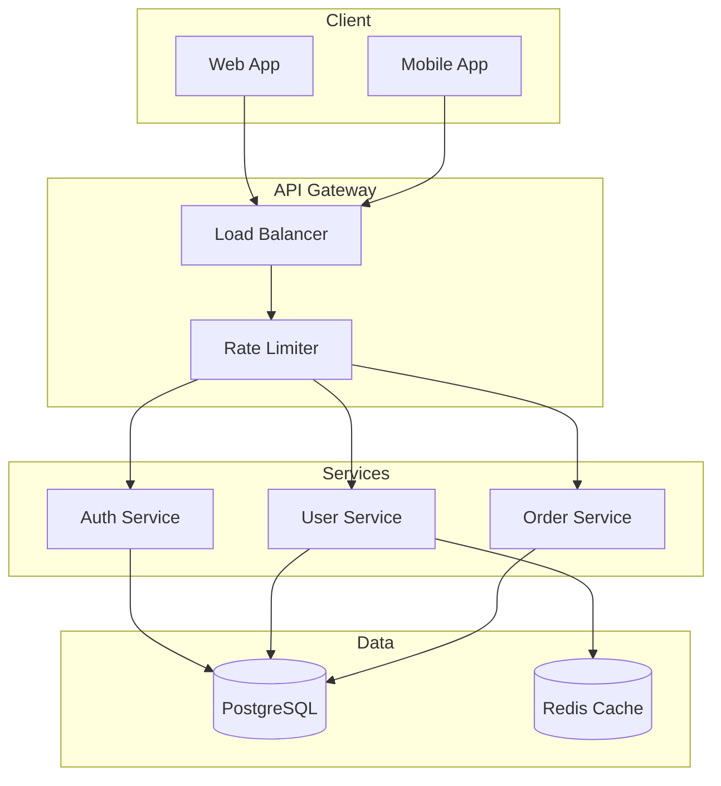

# Skill: Code Explanation and Documentation Generation

## Overview

ML-powered documentation generation including function docstrings, README files, API documentation, and architecture diagrams.

---

## Architecture

```
┌─────────────────────────────────────────────────────────────┐
│            DOCUMENTATION GENERATION PIPELINE                │
│                                                             │
│   Source Code                                               │
│        │                                                    │
│        ▼                                                    │
│   ┌─────────────────────────────────────────────────────┐  │
│   │              CODE UNDERSTANDING                      │  │
│   │  - AST analysis                                      │  │
│   │  - Type inference                                    │  │
│   │  - Dependency mapping                                │  │
│   └─────────────────────────────────────────────────────┘  │
│        │                                                    │
│        ├─────────────┬─────────────┬─────────────┐         │
│        ▼             ▼             ▼             ▼         │
│   ┌─────────┐   ┌─────────┐   ┌─────────┐   ┌─────────┐   │
│   │Docstring│   │  README │   │   API   │   │  Arch   │   │
│   │Generator│   │Generator│   │  Docs   │   │ Diagrams│   │
│   └────┬────┘   └────┬────┘   └────┬────┘   └────┬────┘   │
│        │             │             │             │         │
│        └─────────────┴──────┬──────┴─────────────┘         │
│                             ▼                               │
│   ┌─────────────────────────────────────────────────────┐  │
│   │              QUALITY VALIDATION                      │  │
│   │  - Accuracy check                                    │  │
│   │  - Completeness score                                │  │
│   │  - Style consistency                                 │  │
│   └─────────────────────────────────────────────────────┘  │
│                             │                               │
│                             ▼                               │
│                    Documentation Output                     │
└─────────────────────────────────────────────────────────────┘
```

---

## Docstring Generation

### Input Analysis

```yaml
code_analysis:
  function: |
    def calculate_compound_interest(
        principal: float,
        rate: float,
        time: int,
        n: int = 12
    ) -> float:
        return principal * (1 + rate/n) ** (n * time)

  extracted:
    name: calculate_compound_interest
    params:
      - name: principal
        type: float
        inferred_meaning: "Initial investment amount"

      - name: rate
        type: float
        inferred_meaning: "Annual interest rate (decimal)"

      - name: time
        type: int
        inferred_meaning: "Investment period in years"

      - name: n
        type: int
        default: 12
        inferred_meaning: "Compounding frequency per year"

    returns:
      type: float
      meaning: "Final amount after compound interest"
```

### Generated Docstring

```python
def calculate_compound_interest(
    principal: float,
    rate: float,
    time: int,
    n: int = 12
) -> float:
    """
    Calculate compound interest on an investment.

    Computes the final amount using the compound interest formula:
    A = P(1 + r/n)^(nt)

    Args:
        principal: Initial investment amount in currency units.
        rate: Annual interest rate as a decimal (e.g., 0.05 for 5%).
        time: Investment period in years.
        n: Number of times interest is compounded per year.
            Defaults to 12 (monthly compounding).

    Returns:
        The final amount after applying compound interest.

    Raises:
        ValueError: If principal or rate is negative.

    Example:
        >>> calculate_compound_interest(1000, 0.05, 10)
        1647.01  # $1000 at 5% for 10 years, monthly compounding

    Note:
        For continuous compounding, use n → ∞ or a separate function.
    """
    return principal * (1 + rate/n) ** (n * time)
```

---

## README Generation

### Project Analysis

```yaml
project_scan:
  structure:
    - src/
    - tests/
    - docs/
    - package.json

  detected:
    language: TypeScript
    framework: Express
    database: PostgreSQL
    testing: Jest
    ci: GitHub Actions

  entry_points:
    - src/index.ts
    - src/server.ts

  key_features:
    - REST API
    - JWT Authentication
    - Rate Limiting
    - Swagger Docs
```

### Generated README

```markdown
# Project Name

Brief description extracted from package.json or inferred from code.

## Features

- 🔐 JWT-based authentication
- 🚀 RESTful API with Express
- 📊 PostgreSQL database integration
- 📝 Auto-generated Swagger documentation
- ⚡ Rate limiting and security middleware

## Quick Start

### Prerequisites

- Node.js 18+
- PostgreSQL 14+

### Installation

\`\`\`bash
npm install
cp .env.example .env
npm run db:migrate
npm run dev
\`\`\`

### Environment Variables

| Variable | Description | Default |
|----------|-------------|---------|
| DATABASE_URL | PostgreSQL connection string | - |
| JWT_SECRET | Secret for JWT signing | - |
| PORT | Server port | 3000 |

## API Documentation

Available at `/api/docs` when running locally.

### Key Endpoints

| Method | Path | Description |
|--------|------|-------------|
| POST | /auth/login | User login |
| GET | /users | List users |
| POST | /users | Create user |

## Testing

\`\`\`bash
npm test           # Run tests
npm run test:cov   # With coverage
\`\`\`

## License

MIT
```

---

## API Documentation

### OpenAPI Generation

```yaml
openapi_generation:
  source: code_analysis

  extracted_endpoints:
    - path: /users
      method: GET
      handler: UserController.list
      params:
        - name: page
          in: query
          type: integer
        - name: limit
          in: query
          type: integer
      responses:
        200:
          description: List of users
          schema: User[]
        401:
          description: Unauthorized
```

### Generated OpenAPI Spec

```yaml
openapi: 3.0.0
info:
  title: User Management API
  version: 1.0.0
  description: API for managing users

paths:
  /users:
    get:
      summary: List all users
      description: Returns a paginated list of users
      parameters:
        - name: page
          in: query
          schema:
            type: integer
            default: 1
        - name: limit
          in: query
          schema:
            type: integer
            default: 20
      responses:
        '200':
          description: Successful response
          content:
            application/json:
              schema:
                type: object
                properties:
                  data:
                    type: array
                    items:
                      $ref: '#/components/schemas/User'
                  pagination:
                    $ref: '#/components/schemas/Pagination'
```

---

## Architecture Documentation

### Diagram Generation

```yaml
diagram_types:
  - system_architecture
  - data_flow
  - sequence_diagrams
  - class_diagrams
  - er_diagrams

generation:
  format: mermaid
  output: docs/architecture/
```

### Generated Mermaid Diagram



---

## Documentation Quality

### Validation Checks

```yaml
quality_checks:
  completeness:
    - all_public_functions_documented
    - all_params_described
    - all_returns_documented
    - examples_included

  accuracy:
    - param_types_match_code
    - return_types_match_code
    - examples_execute_correctly

  style:
    - consistent_formatting
    - proper_grammar
    - appropriate_length
```

### Quality Report

```
━━━━━━━━━━━━━━━━━━━━━━━━━━━━━━━━━━━━━━━━━━━━━━━━━
       DOCUMENTATION QUALITY REPORT
━━━━━━━━━━━━━━━━━━━━━━━━━━━━━━━━━━━━━━━━━━━━━━━━━

  Overall Score: 87/100

  Completeness: 92%
    ✅ All public functions documented
    ✅ Parameters described
    ⚠️ 3 functions missing examples

  Accuracy: 95%
    ✅ Types match code
    ✅ Examples verified

  Style: 75%
    ⚠️ Inconsistent capitalization
    ⚠️ Some descriptions too brief

  Suggestions:
    1. Add examples to UserService.update()
    2. Expand description for parseConfig()
    3. Standardize header capitalization

━━━━━━━━━━━━━━━━━━━━━━━━━━━━━━━━━━━━━━━━━━━━━━━━━
```

---

## Commands

```bash
# Generate docstrings for a file
/docs generate src/services/

# Generate README
/docs readme

# Generate API docs
/docs api --format openapi

# Generate architecture diagrams
/docs architecture --format mermaid

# Validate existing docs
/docs validate

# Update stale documentation
/docs sync
```

---

## Configuration

```yaml
# config/doc_generation.yaml
documentation:
  enabled: true

  docstrings:
    style: google  # google, numpy, sphinx
    include_examples: true
    include_raises: true

  readme:
    auto_update: true
    sections:
      - features
      - installation
      - usage
      - api
      - contributing

  api_docs:
    format: openapi
    output: docs/api.yaml
    include_examples: true

  architecture:
    diagrams: true
    format: mermaid
    output: docs/architecture/

  quality:
    min_score: 80
    block_pr_on_low: true
```

---

*Automated documentation for maintainable codebases.*
